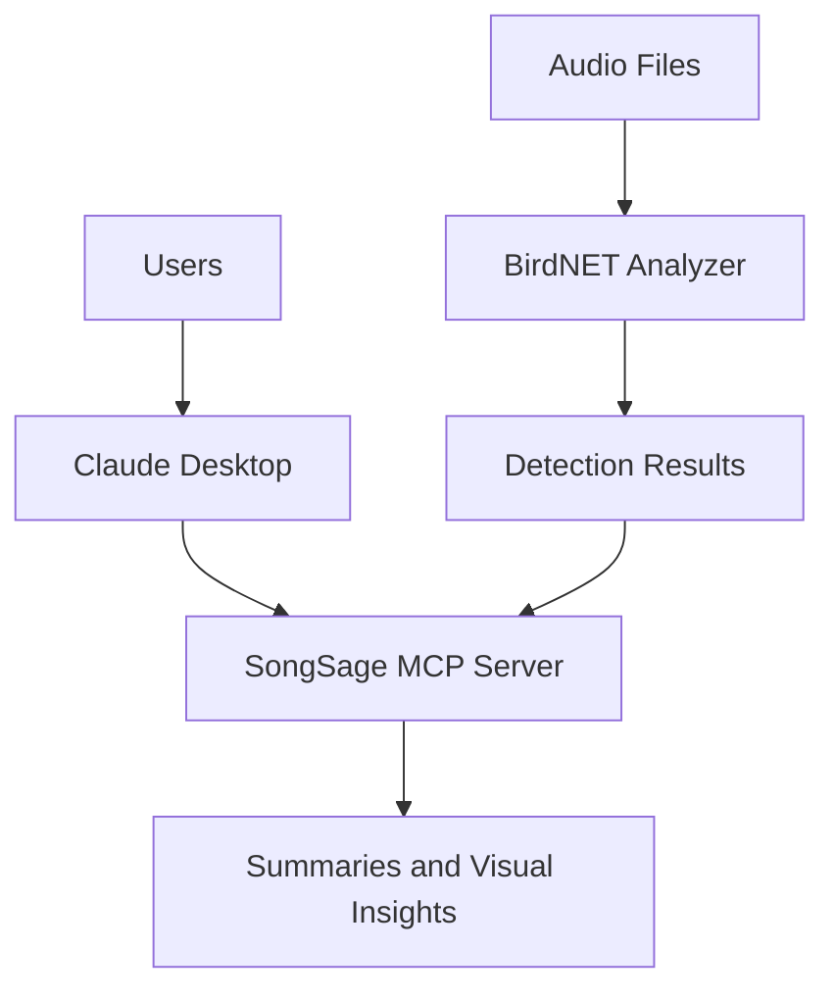

# 🎶 SongSage
### Conversational Bioacoustic Wildlife Monitoring with BirdNET and MCP
SongSage is a Model Context Protocol (MCP) layer for bioacoustic analysis that augments BirdNET-Analyzer-Sierra detections with contextual reasoning, uncertainty-aware summaries, and ecologist-oriented insight extraction.

Rather than stopping at raw species detections, SongSage enables natural-language ecological interpretation of BirdNET outputs—helping researchers explore patterns, confidence, rarity, and temporal dynamics in large-scale acoustic datasets.

## Why SongSage Exists

Bioacoustic monitoring is increasingly used to study biodiversity and ecosystem health, but the outputs of state-of-the-art models like BirdNET are typically static files that require custom scripts and technical expertise to analyze.

SongSage turns these detections into an interactive, conversational analysis system. By exposing BirdNET results through a Model Context Protocol (MCP) server, ecologists, conservation practitioners, and citizen scientists can query, summarize, and visualize real-world acoustic data using natural language—without writing code.


## 🔍 Motivation: From Research to Real-World Use

Bioacoustic sensing is a scalable, low-impact approach for monitoring bird populations, but the outputs of state-of-the-art models like BirdNET are often difficult to explore without custom analysis pipelines.

Inspired by multimodal wildlife monitoring research at the SmartWilds framework, SongSage focuses on the missing interaction layer—turning BirdNET detections into an interactive system that supports human-in-the-loop exploration and real-world ecological analysis.

## 🧭 What Is SongSage?

SongSage is an interactive bioacoustic analysis system that connects BirdNET’s bird species detections with a conversational AI interface. It allows users to query, summarize, and visualize bird activity from real-world audio recordings using natural language instead of custom scripts.

Designed for ecologists, conservation practitioners, and citizen scientists, SongSage transforms static BirdNET outputs into a usable analysis layer, supporting exploratory data analysis, long-term monitoring, and human-in-the-loop ecological insight.

## 🏗️ System Architecture


## 🧪 Key Capabilities

- **Bioacoustic Analysis Pipeline**  
  Integrates BirdNET for automated bird species detection from long-duration audio recordings, supporting scalable biodiversity monitoring.

- **Conversational AI Interface via MCP**  
  Exposes analysis workflows through a Model Context Protocol (MCP) server, enabling natural-language queries and human-in-the-loop exploration in Claude Desktop.

- **Structured Data Ingestion and Normalization**  
  Loads and standardizes BirdNET detection outputs across multiple formats, with automated column mapping and schema normalization.

- **Interactive Query and Aggregation**  
  Supports filtering, aggregation, and summarization of detections by species, time, confidence, and recording context.

- **Temporal and Ecological Analytics**  
  Enables analysis of daily, seasonal, and long-term activity patterns to support ecological interpretation and monitoring.

- **Visualization and Insight Generation**  
  Produces visual summaries such as activity heatmaps and temporal plots to surface trends and behavioral signals.

- **Production-Oriented System Design**  
  Implements caching, modular components, and clear separation between inference, interaction, and analysis layers for extensibility.

- **Real-World Deployment Readiness**  
  Designed for use by ecologists and citizen scientists analyzing real acoustic data, emphasizing usability, reproducibility, and clarity.lyzing real acoustic data, emphasizing usability, reproducibility, and clarity.

  ## 🛠️ Interaction Model (MCP)

SongSage exposes its functionality through the Model Context Protocol (MCP), allowing Claude Desktop to interact with bioacoustic data via executable tools, read-only resources, and guided prompts. This structure enables natural-language-driven analysis while maintaining clear separation between data access, computation, and user workflows.

## 📋 Prerequisites

- Python 3.10+
- BirdNET-Analyzer-Sierra installed locally  
  https://github.com/birdnet-team/BirdNET-Analyzer-Sierra
- Claude Desktop


## 📦 Installation

```bash
git clone https://github.com/<your-username>/songsage.git
cd songsage

'''

```md
## 🧪 Create and Activate a Virtual Environment

```bash
python -m venv venv

macOS / 🐧 Linux
source venv/bin/activate

🪟 Windows
venv\Scripts\activate

📥 Install Dependencies
pip install -r requirements.txt


