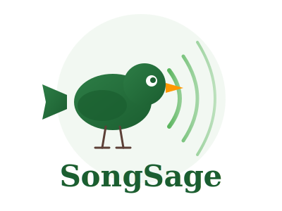
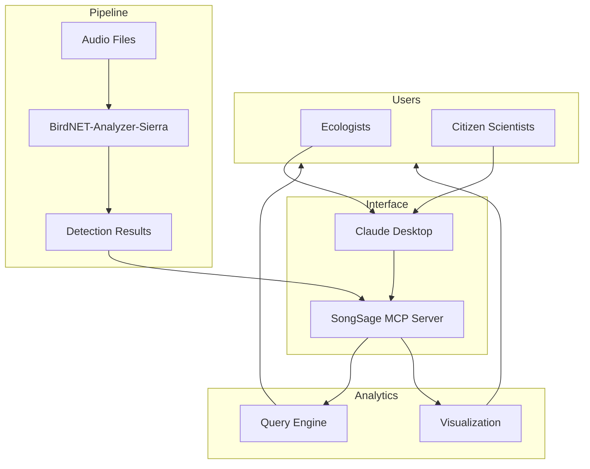

<p align="center">
  
</p>

<h1 align="center">SongSage</h1>

<p align="center">
  <strong>Conversational Bioacoustic Wildlife Monitoring with BirdNET and MCP</strong>
</p>

SongSage is a Model Context Protocol (MCP) server that connects [BirdNET-Analyzer-Sierra](https://github.com/birdnet-team/BirdNET-Analyzer-Sierra) with Claude Desktop, enabling natural language interaction with bioacoustic data for wildlife monitoring and conservation research.

[](https://www.python.org/downloads/)
[](https://opensource.org/licenses/MIT)
[](https://modelcontextprotocol.io/)

---

## Why SongSage?

Bioacoustic monitoring is a powerful tool for studying biodiversity, but BirdNET outputs are static CSV files requiring custom scripts to analyze. SongSage transforms these detections into an **interactive, conversational analysis system**.

Ecologists, conservation practitioners, and citizen scientists can now query, summarize, and visualize acoustic data using natural language—no coding required.

> Inspired by multimodal wildlife monitoring research, including the [SmartWilds framework](https://imageomics.github.io/naturelab/) at The Wilds Conservation Center.

---

## Architecture



---

## Key Capabilities

| Feature | Description |
|---------|-------------|
| **Natural Language Queries** | Ask questions about your data in plain English |
| **Species Detection** | Leverage BirdNET's species recognition |
| **Temporal Analytics** | Analyze daily, seasonal, and long-term patterns |
| **Interactive Filtering** | Filter by species, confidence, time, and location |
| **Heatmap Generation** | Visualize activity patterns across time and species |

---

## Installation

See [docs/installation.md](docs/installation.md) for the complete setup guide, including platform-specific configuration for Mac/Linux and Windows.

**Quick summary:**

1. Clone the repo and run `setup.sh` (Mac/Linux) or set up the venv manually (Windows)
2. Add SongSage to your Claude Desktop config with full absolute paths
3. Optionally create a `.env` file if BirdNET isn't auto-detected

---

## Usage Examples

**Daily Monitoring**
> "Summarize bird activity from today's recordings."

**Rare Species**
> "Find species detected fewer than 3 times with confidence above 0.7."

**Peak Activity**
> "When are birds most active during the day?"

**Species Deep Dive**
> "Show me everything about Northern Cardinal detections."

**Temporal Comparison**
> "Compare bird activity between June and July."

**Visualization**
> "Generate a heatmap of activity by hour for the top 10 species."

---

## Tools

### Analysis

| Tool | Description |
|------|-------------|
| `analyze_audio` | Run BirdNET on a single audio file |
| `analyze_audio_batch` | Process multiple files with pattern matching |
| `list_audio_files` | List available audio files |

### Queries

| Tool | Description |
|------|-------------|
| `list_detected_species` | Species list with counts and confidence stats |
| `get_detections` | Raw detection data with flexible filtering |
| `get_daily_summary` | Aggregated daily statistics |
| `get_species_details` | Detailed info for a specific species |
| `find_rare_detections` | Identify potential rare visitors |
| `get_peak_activity_times` | Analyze activity patterns |

### Visualization

| Tool | Description |
|------|-------------|
| `generate_heatmap` | Activity heatmaps by time, species, or day |
| `list_heatmap_types` | Available visualization types |
| `list_colormaps` | Color scheme options |

### Utilities

| Tool | Description |
|------|-------------|
| `reload_data` | Refresh cached data |
| `export_csv` | Export filtered results |
| `inspect_csv_structure` | Examine data structure |

---

## Guided Workflows (Prompts)

Pre-built multi-step analyses:

| Prompt | Description |
|--------|-------------|
| `daily_summary` | Comprehensive daily activity report |
| `species_deep_dive` | Full analysis of a single species |
| `analyze_rare_birds` | Find and verify rare detections |
| `peak_activity_report` | Identify optimal recording times |
| `compare_time_periods` | Compare activity across date ranges |
| `quality_check` | Identify potential false positives |
| `generate_activity_heatmap` | Create and interpret visualizations |

---

## Project Structure

```
SongSage/
├── assets/               # Logo 
├── docs/                 # Documentation
│   ├── documentation.md  # Full technical reference
│   └── installation.md   # Installation and configuration guide
├── heatmaps/             # Generated visualizations
├── test_data/            # Sample CSV files for setup verification (see installation guide)
├── mcp_server.py         # MCP server implementation
├── requirements.txt      # Python dependencies
├── __init__.py           # Python package init
├── .env.example          # Configuration template
└── setup.sh              # Linux/macOS installer
```

---

## Research Context

SongSage builds on multimodal wildlife monitoring approaches. The [SmartWilds project](https://imageomics.github.io/naturelab/) demonstrates how bioacoustic sensors complement camera traps and drone imagery for ecosystem monitoring—bioacoustics provide continuous temporal coverage and detect species that visual methods miss.

This tool lowers the barrier for researchers and citizen scientists to explore acoustic biodiversity data through conversation rather than code.

---

## Acknowledgments

- [BirdNET Team](https://github.com/birdnet-team) — Cornell Lab of Ornithology & Chemnitz University
- [Anthropic](https://www.anthropic.com/) — Claude and Model Context Protocol
- [The Wilds Conservation Center](https://thewilds.org/)
- [Imageomics Institute](https://imageomics.org/) & [ABC Global Center](http://abcresearchcenter.org/)
- SmartWilds Team, The Ohio State University and [The Wilds](https://www.thewilds.org/)

This work was supported by both the [Imageomics Institute](https://imageomics.org) and the [AI and Biodiversity Change (ABC) Global Center](http://abcresearchcenter.org). The Imageomics Institute is funded by the US National Science Foundation's Harnessing the Data Revolution (HDR) program under [Award #2118240](https://www.nsf.gov/awardsearch/showAward?AWD_ID=2118240) (Imageomics: A New Frontier of Biological Information Powered by Knowledge-Guided Machine Learning). The ABC Global Center is funded by the US National Science Foundation under [Award No. 2330423](https://www.nsf.gov/awardsearch/showAward?AWD_ID=2330423&HistoricalAwards=false) and Natural Sciences and Engineering Research Council of Canada under [Award No. 585136](https://www.nserc-crsng.gc.ca/ase-oro/Details-Detailles_eng.asp?id=782440). This project draws on research supported by the Social Sciences and Humanities Research Council. Some additional support was provided by the [NSF AI Institute for Intelligent Cyberinfrastructure with Computational Learning in the Environment (ICICLE)](https://aiira.iastate.edu/), funded under NSF Award OAC-2112606. Any opinions, findings and conclusions or recommendations expressed in this material are those of the author(s) and do not necessarily reflect the views of the National Science Foundation, Natural Sciences and Engineering Research Council of Canada, or Social Sciences and Humanities Research Council.
