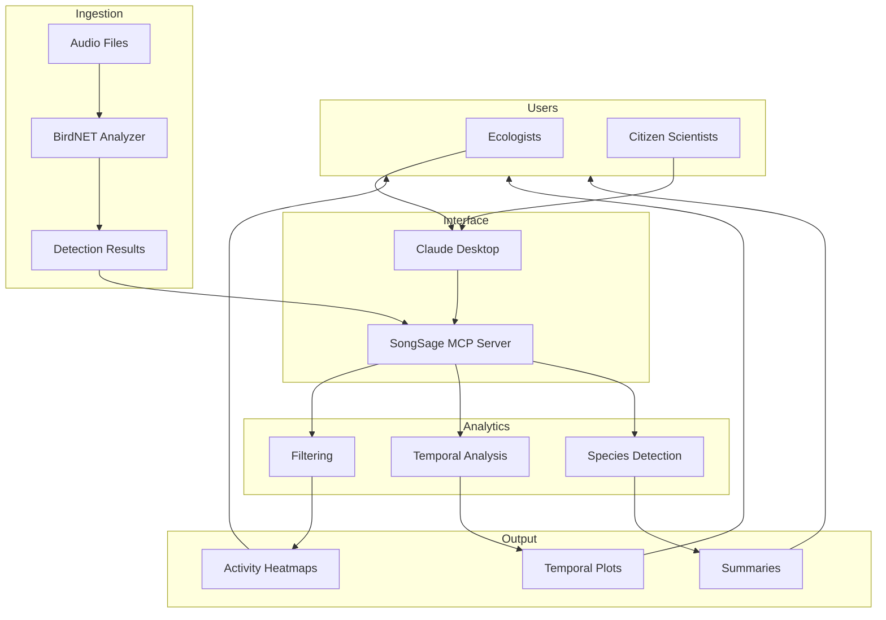

# 🎶 SongSage

### Conversational Bioacoustic Wildlife Monitoring with BirdNET and MCP

SongSage is a Model Context Protocol (MCP) server that bridges [BirdNET-Analyzer](https://github.com/kahst/BirdNET-Analyzer) with Claude Desktop, enabling natural language interaction with bioacoustic data for wildlife monitoring and conservation research.

[](https://www.python.org/downloads/)
[](https://opensource.org/licenses/MIT)
[](https://modelcontextprotocol.io/)

---

## 🔍 Motivation

Bioacoustic monitoring is increasingly used to study biodiversity and ecosystem health, but the outputs of state-of-the-art models like BirdNET are typically static CSV files that require custom scripts and technical expertise to analyze.

**SongSage turns these detections into an interactive, conversational analysis system.** By exposing BirdNET results through a Model Context Protocol (MCP) server, ecologists, conservation practitioners, and citizen scientists can query, summarize, and visualize real-world acoustic data using natural language—without writing code.

This work is inspired by multimodal wildlife monitoring research, including the [SmartWilds framework](https://imageomics.github.io/naturelab/) for synchronized environmental sensing at The Wilds Conservation Center.

---

## 🏗️ System Architecture



---

## 🧪 Key Capabilities

| Capability | Description |
|------------|-------------|
| **Bioacoustic Analysis Pipeline** | Integrates BirdNET for automated bird species detection from long-duration audio recordings |
| **Conversational AI Interface** | Natural-language queries and human-in-the-loop exploration via Claude Desktop |
| **Structured Data Ingestion** | Loads and standardizes BirdNET outputs with automated column mapping |
| **Interactive Query & Aggregation** | Filter by species, time, confidence, and recording context |
| **Temporal & Ecological Analytics** | Analyze daily, seasonal, and long-term activity patterns |
| **Visualization & Insight Generation** | Activity heatmaps, temporal plots, and behavioral trend summaries |
| **Production-Oriented Design** | Caching, modular components, and clear separation of concerns |

---

## 📋 Prerequisites

- Python 3.10+
- [BirdNET-Analyzer](https://github.com/kahst/BirdNET-Analyzer) installed locally
- [Claude Desktop](https://claude.ai/download)

---

## 📦 Installation

### Clone the Repository

```bash
git clone https://github.com/<your-username>/songsage.git
cd songsage
```

### Create and Activate a Virtual Environment

```bash
python -m venv venv
```

**macOS / Linux:**

```bash
source venv/bin/activate
```

**Windows:**

```bash
venv\Scripts\activate
```

### Install Dependencies

```bash
pip install -r requirements.txt
```

---

## ⚙️ Configuration

### Environment Variables

Create a `.env` file in the project root to specify paths to your BirdNET installation:

```bash
BIRDNET_ANALYZER_DIR=/path/to/BirdNET-Analyzer
BIRDNET_RESULTS_DIR=/path/to/BirdNET-Analyzer/results
BIRDNET_AUDIO_DIR=/path/to/audio/files
```

### Claude Desktop Configuration

Add SongSage to your Claude Desktop config file:

| Platform | Config Location |
|----------|-----------------|
| Linux | `~/.config/Claude/claude_desktop_config.json` |
| macOS | `~/Library/Application Support/Claude/claude_desktop_config.json` |
| Windows | `%APPDATA%\Claude\claude_desktop_config.json` |

```json
{
  "mcpServers": {
    "songsage": {
      "command": "/path/to/songsage/venv/bin/python",
      "args": ["-m", "mcp_server"],
      "cwd": "/path/to/songsage"
    }
  }
}
```

Replace `/path/to/songsage` with your actual installation path.

---

## 🔍 Example Workflows

SongSage is designed for natural-language interaction in Claude Desktop. Here are example prompts for real-world ecological workflows:

### Daily Monitoring Summary

> "Summarize bird activity detected in today's audio recordings and list the most active species."

### Rare Species Detection

> "Show bird species detected fewer than three times this week with confidence above 0.7."

### Temporal Activity Analysis

> "When are birds most active during the day across all recordings?"

### Species-Specific Exploration

> "Give me a detailed summary of detections for Northern Cardinal, including confidence statistics and activity patterns."

### Seasonal Trends

> "Compare bird activity between early summer and late summer recordings."

### Visualization

> "Generate a heatmap showing bird activity by hour of day for the most frequently detected species."

---

## 🛠️ MCP Tools Reference

### Analysis Tools

| Tool | Description |
|------|-------------|
| `analyze_audio` | Run BirdNET on a single audio file with confidence and location filtering |
| `analyze_audio_batch` | Analyze multiple files with pattern matching and combined results |
| `analyze_audio_custom` | Analyze with customizable output columns |
| `list_audio_files` | List available audio files with sizes and formats |

### Data Query Tools

| Tool | Description |
|------|-------------|
| `list_detected_species` | List species with counts and confidence statistics |
| `get_detections` | Get raw detection data with flexible filtering |
| `get_daily_summary` | Detection summary aggregated by day |
| `get_species_details` | Detailed info for a specific species |
| `find_rare_detections` | Find rarely detected species (potential rare visitors) |
| `get_peak_activity_times` | Analyze when bird activity peaks |
| `get_confidence_statistics` | Detailed confidence statistics per species |

### Visualization Tools

| Tool | Description |
|------|-------------|
| `generate_heatmap` | Generate activity heatmaps (species_by_time, day_by_hour, etc.) |
| `generate_heatmap_dynamic` | Custom heatmaps from any CSV with flexible transforms |
| `list_heatmap_types` | List available heatmap types with descriptions |
| `list_colormaps` | List available color schemes |

### Utility Tools

| Tool | Description |
|------|-------------|
| `reload_data` | Force reload CSV data, clearing the cache |
| `inspect_csv_structure` | Inspect CSV structure and column mappings |
| `export_csv` | Export filtered data to custom CSV files |

---

## 📊 Pre-built Prompts

Prompts are guided multi-step workflows for complex analyses:

### Analysis Workflows

| Prompt | Description |
|--------|-------------|
| `analyze_rare_birds` | Find rare species with verification recommendations |
| `daily_summary` | Comprehensive daily activity summary with trends |
| `species_deep_dive` | Complete analysis of a specific species |
| `peak_activity_report` | Identify best recording times and activity patterns |
| `compare_time_periods` | Compare activity between two date ranges |
| `quality_check` | Analyze detection quality and identify false positives |

### Visualization Prompts

| Prompt | Description |
|--------|-------------|
| `generate_activity_heatmap` | Generate and interpret activity heatmaps |
| `choose_heatmap_colors` | Help choosing the best colormap for your data |
| `heatmap_from_any_csv` | Step-by-step guide for any CSV structure |

---

## 📁 Project Structure

```
songsage/
├── mcp_server.py          # MCP server implementation
├── __init__.py            # Package initialization
├── requirements.txt       # Python dependencies
├── .env.example           # Configuration template
├── setup.sh               # Linux/macOS installer
├── heatmaps/              # Generated visualizations
└── README.md              # This file
```

---

## 🔬 Research Context

SongSage builds on approaches from multimodal wildlife monitoring research. The SmartWilds project at The Ohio State University demonstrates how bioacoustic sensors, camera traps, and drone imagery can be integrated for comprehensive ecosystem monitoring.

Key insights from this research:

- **Bioacoustic sensors** provide continuous temporal coverage and detect cryptic/vocal species
- **Complementary modalities** (visual + acoustic) improve species detection across conditions
- **Conversational interfaces** lower barriers for ecologists and citizen scientists to explore data

For more information, see the [SmartWilds dataset](https://imageomics.github.io/naturelab/) and related publications on multimodal wildlife monitoring.

---

## 🐛 Troubleshooting

| Issue | Solution |
|-------|----------|
| Server not starting | Check Python path in Claude Desktop config |
| No data loaded | Verify `BIRDNET_RESULTS_DIR` path and check for CSV files |
| Heatmap not displaying | Ensure `heatmaps/` directory exists |
| Module not found | Activate venv and reinstall requirements |
| Windows path issues | Use forward slashes in config paths |

### Debug Logs

Check Claude Desktop logs for errors:

- **Linux:** `~/.config/Claude/logs/`
- **macOS:** `~/Library/Logs/Claude/`
- **Windows:** `%APPDATA%\Claude\logs\`

---

## 🤝 Contributing

Contributions are welcome! Please:

1. Maintain cross-platform compatibility
2. Add appropriate error handling
3. Update documentation for new features
4. Test with both wide and long format CSVs

---

## 📄 License

MIT License. See [LICENSE](LICENSE) for details.

BirdNET-Analyzer has its own license terms for the AI model—see the [BirdNET repository](https://github.com/kahst/BirdNET-Analyzer) for details.

---

## 🙏 Acknowledgments

- [Cornell Lab of Ornithology](https://www.birds.cornell.edu/) and [Chemnitz University of Technology](https://www.tu-chemnitz.de/) for BirdNET
- [Anthropic](https://www.anthropic.com/) for Claude and the Model Context Protocol
- [The Wilds Conservation Center](https://thewilds.org/) for supporting wildlife monitoring research
- The SmartWilds team at The Ohio State University
