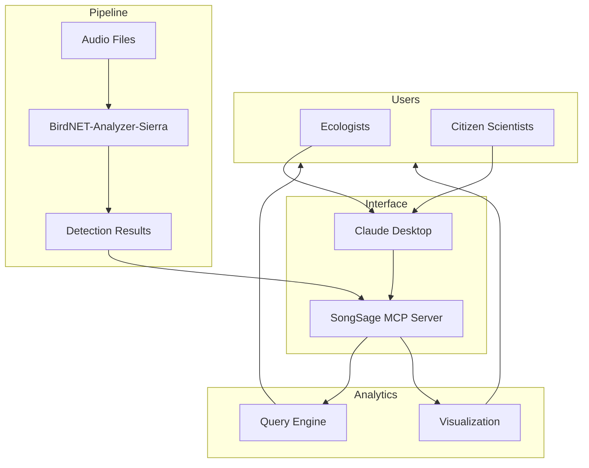

<p align="center">
  
</p>

<h1 align="center">SongSage</h1>

<p align="center">
  <strong>Conversational Bioacoustic Wildlife Monitoring with BirdNET and MCP</strong>
</p>

SongSage is a Model Context Protocol (MCP) server that connects [BirdNET-Analyzer-Sierra](https://github.com/birdnet-team/BirdNET-Analyzer-Sierra) with Claude Desktop, enabling natural language interaction with bioacoustic data for wildlife monitoring and conservation research.

[](https://www.python.org/downloads/)
[](https://opensource.org/licenses/MIT)
[](https://modelcontextprotocol.io/)

---

## Why SongSage?

Bioacoustic monitoring is a powerful tool for studying biodiversity, but BirdNET outputs are static CSV files requiring custom scripts to analyze. SongSage transforms these detections into an **interactive, conversational analysis system**.

Ecologists, conservation practitioners, and citizen scientists can now query, summarize, and visualize acoustic data using natural language—no coding required.

> Inspired by multimodal wildlife monitoring research, including the [SmartWilds framework](https://imageomics.github.io/naturelab/) at The Wilds Conservation Center.

---

## Architecture



---

## Key Capabilities

| Feature | Description |
|---------|-------------|
| **Natural Language Queries** | Ask questions about your data in plain English |
| **Species Detection** | Leverage BirdNET's species recognition |
| **Temporal Analytics** | Analyze daily, seasonal, and long-term patterns |
| **Interactive Filtering** | Filter by species, confidence, time, and location |
| **Heatmap Generation** | Visualize activity patterns across time and species |

---

## Prerequisites

- Python 3.10+
- [BirdNET-Analyzer-Sierra](https://github.com/birdnet-team/BirdNET-Analyzer-Sierra)
- [Claude Desktop](https://claude.ai/download)

---

## Installation

> **Platform-specific guides:** [Linux](INSTALL_LINUX.md) | [macOS](INSTALL_MAC.md) | [Windows](INSTALL_WINDOWS.md)

### 1. Clone the Repository

```bash
git clone https://github.com/Imageomics/SongSage.git
cd SongSage
```

### 2. Create Virtual Environment

```bash
python -m venv venv
```

**macOS / Linux:**

```bash
source venv/bin/activate
```

**Windows:**

```bash
venv\Scripts\activate
```

### 3. Install Dependencies

```bash
pip install -r requirements.txt
```

### 4. Configure Environment

Create a `.env` file in the project root (or copy from `.env.example`):

```bash
BIRDNET_RESULTS_DIR=/path/to/BirdNET-Analyzer-Sierra/results
BIRDNET_AUDIO_DIR=/path/to/BirdNET-Analyzer-Sierra/recordings
BIRDNET_ANALYZER_DIR=/path/to/BirdNET-Analyzer-Sierra
```

> If BirdNET-Analyzer-Sierra is installed at `~/BirdNET-Analyzer-Sierra`, the server will auto-detect it and a `.env` file is optional.

### 5. Configure Claude Desktop

Add to your Claude Desktop config:

| Platform | Config Location |
|----------|-----------------|
| Linux | `~/.config/Claude/claude_desktop_config.json` |
| macOS | `~/Library/Application Support/Claude/claude_desktop_config.json` |
| Windows | `%APPDATA%\Claude\claude_desktop_config.json` |

**macOS / Linux:**

```json
{
  "mcpServers": {
    "songsage": {
      "command": "/full/path/to/SongSage/venv/bin/python",
      "args": ["/full/path/to/SongSage/mcp_server.py"],
      "cwd": "/full/path/to/SongSage"
    }
  }
}
```

**Windows:**

```json
{
  "mcpServers": {
    "songsage": {
      "command": "C:/Users/YOUR_USERNAME/SongSage/venv/Scripts/python.exe",
      "args": ["C:/Users/YOUR_USERNAME/SongSage/mcp_server.py"],
      "cwd": "C:/Users/YOUR_USERNAME/SongSage"
    }
  }
}
```

> **Important:** All three paths (`command`, `args`, and `cwd`) must be **full absolute paths** — no `~`, no relative paths. Run `pwd` (macOS/Linux) or `cd` (Windows) inside the SongSage folder to get the exact path.

---

## Verify Your Setup

After installation, confirm everything is working:

### 1. Use the Sample Test Data

SongSage includes sample BirdNET CSV files in the `test_data/` folder. To test without your own BirdNET results, point your `.env` at the sample data:

```bash
# In your .env file, temporarily set:
BIRDNET_RESULTS_DIR=/full/path/to/SongSage/test_data
```

### 2. Restart Claude Desktop

After editing the config, fully quit and reopen Claude Desktop. Look for the MCP tools icon (hammer icon) in the chat input area — it should show **songsage** as a connected server.

### 3. Test These Prompts in Claude Desktop

Type each of these into Claude Desktop to verify the connection:

**Check if the server is connected:**
> "List all detected bird species"

Expected: A list of species with detection counts and confidence scores.

**Test filtering:**
> "Find rare species with confidence above 0.7"

Expected: Species with very few detections and high confidence.

**Test visualization:**
> "Generate a heatmap of species by time of day"

Expected: A heatmap image displayed directly in the chat.

If any of these fail, check the [Troubleshooting](#troubleshooting) section below.

---

## Usage Examples

**Daily Monitoring**
> "Summarize bird activity from today's recordings."

**Rare Species**
> "Find species detected fewer than 3 times with confidence above 0.7."

**Peak Activity**
> "When are birds most active during the day?"

**Species Deep Dive**
> "Show me everything about Northern Cardinal detections."

**Temporal Comparison**
> "Compare bird activity between June and July."

**Visualization**
> "Generate a heatmap of activity by hour for the top 10 species."

---

## Tools

### Analysis

| Tool | Description |
|------|-------------|
| `analyze_audio` | Run BirdNET on a single audio file |
| `analyze_audio_batch` | Process multiple files with pattern matching |
| `list_audio_files` | List available audio files |

### Queries

| Tool | Description |
|------|-------------|
| `list_detected_species` | Species list with counts and confidence stats |
| `get_detections` | Raw detection data with flexible filtering |
| `get_daily_summary` | Aggregated daily statistics |
| `get_species_details` | Detailed info for a specific species |
| `find_rare_detections` | Identify potential rare visitors |
| `get_peak_activity_times` | Analyze activity patterns |

### Visualization

| Tool | Description |
|------|-------------|
| `generate_heatmap` | Activity heatmaps by time, species, or day |
| `list_heatmap_types` | Available visualization types |
| `list_colormaps` | Color scheme options |

### Utilities

| Tool | Description |
|------|-------------|
| `reload_data` | Refresh cached data |
| `export_csv` | Export filtered results |
| `inspect_csv_structure` | Examine data structure |

---

## Guided Workflows (Prompts)

Pre-built multi-step analyses:

| Prompt | Description |
|--------|-------------|
| `daily_summary` | Comprehensive daily activity report |
| `species_deep_dive` | Full analysis of a single species |
| `analyze_rare_birds` | Find and verify rare detections |
| `peak_activity_report` | Identify optimal recording times |
| `compare_time_periods` | Compare activity across date ranges |
| `quality_check` | Identify potential false positives |
| `generate_activity_heatmap` | Create and interpret visualizations |

---

## Project Structure

```
SongSage/
├── assets/             # Logo and images
├── heatmaps/           # Generated visualizations
├── test_data/          # Sample CSV files for setup verification
├── mcp_server.py       # MCP server implementation
├── requirements.txt    # Python dependencies
├── __init__.py         # Python package init
├── .env.example        # Configuration template
├── setup.sh            # Linux/macOS installer
├── DOCUMENTATION.md    # Extended documentation
├── INSTALL_LINUX.md    # Linux installation guide
├── INSTALL_MAC.md      # macOS installation guide
├── INSTALL_WINDOWS.md  # Windows installation guide
├── WINDOWS_QUICK_FIX.md # Windows Git Bash troubleshooting
└── README.md
```

---

## Troubleshooting

| Issue | Solution |
|-------|----------|
| Server won't start | Verify all paths in Claude config are **full absolute paths** to the correct locations |
| No data loaded | Check that `BIRDNET_CSV_FILE` in `.env` points to a directory containing `.csv` files |
| Heatmaps missing | Ensure `heatmaps/` directory exists: `mkdir -p heatmaps` |
| Import errors | Activate venv: `source venv/bin/activate` then `pip install -r requirements.txt` |

### Broken venv after moving the project

If you moved or renamed the SongSage folder after creating the venv, the venv will break. Recreate it:

```bash
cd /path/to/SongSage
rm -rf venv
python3 -m venv venv
source venv/bin/activate    # macOS/Linux
pip install -r requirements.txt
```

Then update all paths in `claude_desktop_config.json` to match the new location.

### Claude Desktop shows server disconnected

1. Fully quit Claude Desktop (not just close the window) and reopen it
2. Check that the `command` path in your config points to the **venv python**, not the system python
3. Check the debug logs for error messages (see below)

### MCP tools not generating output

If Claude Desktop connects but tools return errors or no output:

1. Verify your `.env` file has correct paths and the CSV directory is not empty
2. Ask Claude to `"reload data"` to force a cache refresh
3. Try a simple query first: `"List all detected species"` — if this works, the server is healthy
4. Check that the `heatmaps/` directory exists and is writable (needed for visualizations)

### Debug logs

Check the server-specific log for detailed error messages:

| Platform | Log location |
|----------|-------------|
| Linux | `~/.config/Claude/logs/mcp-server-songsage.log` |
| macOS | `~/Library/Logs/Claude/mcp-server-songsage.log` |
| Windows | `%APPDATA%\Claude\logs\mcp-server-songsage.log` |

General MCP and Claude Desktop logs are in the same directory (`mcp.log`, `main.log`).

---

## Research Context

SongSage builds on multimodal wildlife monitoring approaches. The [SmartWilds project](https://imageomics.github.io/naturelab/) demonstrates how bioacoustic sensors complement camera traps and drone imagery for ecosystem monitoring—bioacoustics provide continuous temporal coverage and detect species that visual methods miss.

This tool lowers the barrier for researchers and citizen scientists to explore acoustic biodiversity data through conversation rather than code.

---


## License

MIT License. See [LICENSE](LICENSE) for details.

BirdNET-Analyzer-Sierra is subject to its own [license terms](https://github.com/birdnet-team/BirdNET-Analyzer-Sierra).

---

## Acknowledgments

- [BirdNET Team](https://github.com/birdnet-team) — Cornell Lab of Ornithology & Chemnitz University
- [Anthropic](https://www.anthropic.com/) — Claude and Model Context Protocol
- [The Wilds Conservation Center](https://thewilds.org/)
- SmartWilds Team, The Ohio State University

This work was supported in part by the [NSF AI Institute for Intelligent Cyberinfrastructure with Computational Learning in the Environment (ICICLE)](https://aiira.iastate.edu/), funded under NSF Award OAC-2112606.
